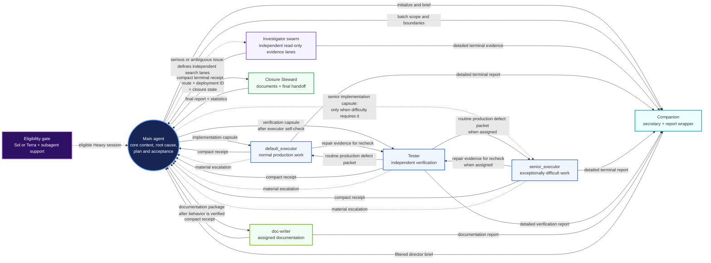

<h3 align="center"><big><big><strong>SIMPLE&emsp;&emsp;───&emsp;&emsp;EASY&emsp;&emsp;───&emsp;&emsp;EFFICIENT</strong></big></big></h3>
<p align="center"><small>&nbsp;&nbsp;&nbsp;&nbsp;&nbsp;&nbsp;&nbsp;(to use)&nbsp;&nbsp;&nbsp;&nbsp;&nbsp;&nbsp;&nbsp;&nbsp;&nbsp;&nbsp;&nbsp;&nbsp;&nbsp;&nbsp;&nbsp;&nbsp;&nbsp;&nbsp;&nbsp;&nbsp;&nbsp;&nbsp;&nbsp;&nbsp;&nbsp;&nbsp;&nbsp;&nbsp;(to install)&nbsp;&nbsp;&nbsp;&nbsp;&nbsp;&nbsp;&nbsp;&nbsp;&nbsp;&nbsp;&nbsp;&nbsp;&nbsp;&nbsp;&nbsp;&nbsp;&nbsp;&nbsp;&nbsp;&nbsp;&nbsp;(token consumption)</small></p>
<hr>


Built for maximum token efficiency: Heavy-route swarm execution with the main
agent as the knowledge director, plus a persistent Companion that handles
routine read-only work and directly filters worker-report batches. Medium keeps
implementation and verification in the main agent while retaining the same
built-in context and progress management across sessions.

> ⭐ For lightweight tasks, it won’t overdo things. Light route is default.

## 1. Quick installation ⚙️

Requires Codex 0.147.0 or newer (the tested subagent-support baseline)
and Python 3.11 or newer for deterministic lifecycle operations.

### Open Codex CLI / Codex app from your project directory 

▶️ Send:

```text
Download and extract the latest `codex_workflow-<version>.zip` asset (not GitHub's Source code archive) from https://github.com/viettran-edgeAI/codex_workflow/releases. Verify it against `SHA256SUMS`, then read the bundled `codex_workflow/bootstrap.md` and follow it to complete the initial installation.
```
> ⭐ Recommended: use 5.6 Luna xhigh for installation. 

🔄 Restart Codex after installation

The initial bootstrap is complete only after its required `doc-writer` action
succeeds; restart Codex after both steps. Once that bootstrap is complete, the
current project is ready to use. Whenever you need to install this workflow for
a new project, simply open Codex and send: `codex_workflow --install`

## 2. Workflow usage 

### This workflow has 3 routes:
- Light route : No subagents, no workflow, minimal context.
- Heavy route : Full workflow mode. Deploy production task workers.
- Medium route: Full workflow mode, with implementation and verification kept
  in the main agent rather than delegated to production task workers.

> Full workflow mode activates the `Companion` secretary and automatic context
> and progress management. Heavy additionally uses bounded investigation teams
> and delegated production workers; Medium may use explicitly requested
> read-only evidence support, but does not delegate implementation or
> verification.

In Medium, the main agent owns implementation and verification. Choose it when
you want workflow-mode context support without delegating production work.

### How to use
- Normally, for simple work, general Q&A, you don't need to do anything. `light route` is the default route.

--------------------------------

- When starting or continuing a plan in progress, tell Codex in the prompt:

```text
use medium/heavy route. [your task description]
```
Or continue a task that was already underway in the previous session: 
```text
use medium/heavy route. Continue ongoing work.
```
Codex stays on the selected route until you change it.
---------------
> **⭐ Recommendation:** Assign very large and complex tasks to the `heavy route` to make the most of its capabilities and maximize token usage savings. Don't hesitate to choose 5.6 Sol xhigh for this route. Using lower reasoning effort will not actually save tokens and will severely reduce its coordination capabilities.

### Coordinating architecture

The Heavy route uses a circular coordination model: the main agent remains the knowledge
director at the center, while specialized workers search, implement, verify,
filter information, and close the deployment around it.



| Role or mechanism | Responsibility | Boundary |
| --- | --- | --- |
| Main agent | Reads task-critical context, identifies the defect, chooses the plan, and owns acceptance. | Delegation reduces token use without outsourcing judgment. |
| Companion | Handles bounded read-only work and turns detailed worker-report batches into one decision-ready brief. | Does not make director-level decisions. |
| Investigators | Explore independent bug, evidence, prior-art, and solution lanes. | The main agent defines lanes and makes the root-cause decision. |
| Role-scoped knowledge | Gives executors implementation guidance, testers verification criteria, and investigators focused search briefs. | Workers receive only the context needed for their role. |
| Executor–tester loop | `default_executor` performs normal production work; the tester verifies it independently. | Routine defects and repair evidence move directly between the paired workers. |
| Senior executor | Handles exceptionally difficult mathematical, logical, or cross-cutting work. | It is a limited reserve, not the default production agent. |
| Doc-writer | Updates assigned durable documentation from verified post-implementation facts. | Does not own automatic closure. |
| Closure Steward | Reconciles project documentation and prepares the final handoff after acceptance. | Stays outside the implementation loop. |

Together, these refinements address the coordination problems that make large
agent deployments expensive and fragile. Direct worker-to-Companion reporting
and the executor–tester repair loop prevent repeated relaying and prefix reads
from causing cached-input explosion; Companion's batch synthesis and the clear
ownership boundaries keep the main agent's context clean, coherent, and less
fragmented. Role-scoped capsules distribute and diffuse the main agent's
architectural knowledge, constraints, rationale, and acceptance model into the
workers without giving up its direct understanding or decision authority. If a
default executor stalls, evidence-driven repair attempts, focused escalation,
and worker replacement keep the deployment moving; when the work itself
exceeds the default executor's reasoning capacity, the limited
`senior_executor` provides dedicated high-difficulty load handling. The result
is broader parallel execution with lower main-agent context cost while retaining
central control and project knowledge.

## Light benchmark


## 3. More details 

Send these exact commands to Codex from the relevant project directory:

| Command | Purpose |
| --- | --- |
| `codex_workflow --install` | Install workflow in the current project and initialize its documentation framework. |
| `codex_workflow --personal` | Add or update project-specific workflow preferences. |
| `codex_workflow --check-update` | Check for a newer release without installing it. |
| `codex_workflow --update` | Download, verify, and install the latest eligible release. |
| `codex_workflow --disable` / `codex_workflow --enable` | Disable or re-enable the workflow for the current project. |
| `codex_workflow --remove` | Remove the installed workflow after a destructive dry-run and confirmation. |

For the complete command reference, installed-file map, scripted customization
guide, and Heavy-route design, see [workflow_usage.md](workflow_usage.md).
